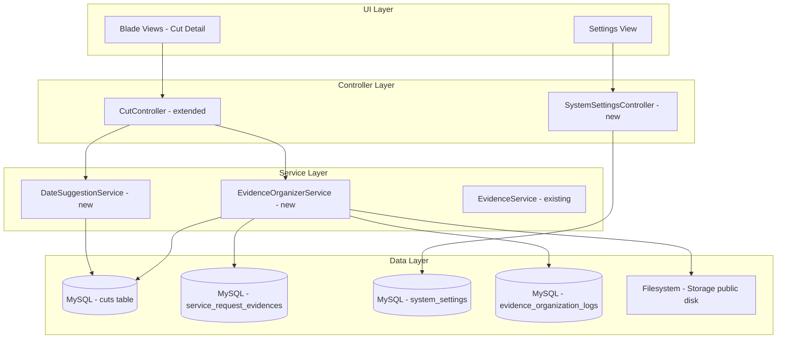
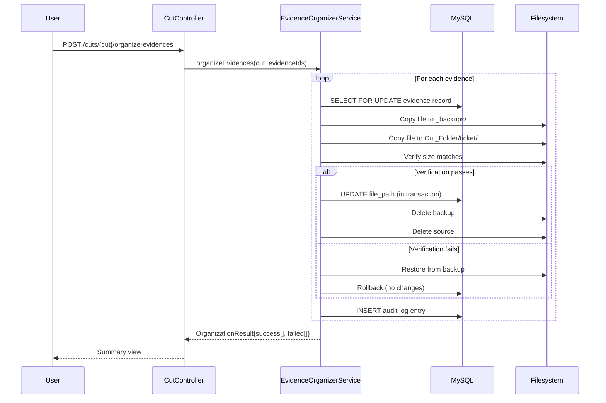

# Design Document: Evidence File Organization

## Overview

Este diseño describe el sistema de organización de archivos de evidencia en carpetas estructuradas por número de corte. El sistema permite mover evidencias desde sus ubicaciones originales hacia una jerarquía de carpetas organizada por corte y solicitud de servicio, garantizando integridad de datos mediante respaldos temporales y operaciones transaccionales.

El sistema se integra con la arquitectura existente de Laravel (EvidenceService, CutController, modelos Cut y ServiceRequestEvidence) sin alterar el flujo actual de subida de archivos, añadiendo una capa de organización post-upload.

### Key Design Decisions

1. **Servicio dedicado (EvidenceOrganizerService)**: Se crea un servicio nuevo en lugar de extender EvidenceService, separando la responsabilidad de organización de la de subida.
2. **Backup antes de mover**: Se implementa un patrón copy-verify-delete en lugar de un simple `rename()` para garantizar integridad entre discos/particiones.
3. **Tabla de configuración genérica**: Se usa una tabla `system_settings` key-value para almacenar la ruta base, extensible a futuras configuraciones.
4. **Columna `folder_path` en `cuts`**: Se añade al modelo existente en lugar de crear una tabla de relación, dado que la relación es 1:1.
5. **Procesamiento independiente por archivo**: Cada archivo se mueve en su propia sub-transacción para maximizar el número de archivos organizados exitosamente en un batch.

## Architecture



### Request Flow - Organize Evidence Files



## Components and Interfaces

### 1. EvidenceOrganizerService

```php
namespace App\Services;

class EvidenceOrganizerService
{
    /**
     * Organiza un lote de evidencias en la carpeta del corte.
     * 
     * @param Cut $cut - Corte destino con folder_path definido
     * @param array<int> $evidenceIds - IDs de evidencias a organizar (1-50)
     * @return OrganizationResult - Resultado con conteos y detalles
     */
    public function organizeEvidences(Cut $cut, array $evidenceIds): OrganizationResult;

    /**
     * Resuelve la ruta base de almacenamiento.
     * Usa la configuración de system_settings o el default.
     */
    public function resolveBasePath(): string;

    /**
     * Genera la ruta sugerida para un nuevo corte.
     */
    public function suggestFolderPath(int $cutId, Carbon $startDate): string;

    /**
     * Crea la carpeta del corte en el filesystem.
     */
    public function createCutFolder(string $folderPath): bool;

    /**
     * Valida un nombre de carpeta personalizado.
     */
    public function validateFolderName(string $name, string $basePath): ValidationResult;

    /**
     * Limpia backups huérfanos con más de 24 horas.
     */
    public function cleanOrphanedBackups(): int;
}
```

### 2. DateSuggestionService

```php
namespace App\Services;

class DateSuggestionService
{
    /**
     * Calcula las fechas sugeridas para un nuevo corte.
     * 
     * @param int $contractId - Contrato activo
     * @return DateSuggestion - start_date y end_date sugeridos
     */
    public function suggestDates(int $contractId): DateSuggestion;

    /**
     * Valida que un rango de fechas no se solape con cortes existentes.
     */
    public function validateNoOverlap(int $contractId, Carbon $start, Carbon $end, ?int $excludeCutId = null): OverlapResult;
}
```

### 3. SystemSettingsController

```php
namespace App\Http\Controllers;

class SystemSettingsController extends Controller
{
    public function edit(): View;           // GET /settings
    public function update(Request $request): RedirectResponse;  // PUT /settings
}
```

### 4. DTOs

```php
namespace App\DTOs;

class OrganizationResult
{
    public array $succeeded;    // Evidence IDs moved successfully
    public array $failed;       // ['evidence_id' => int, 'reason' => string]
    public int $successCount;
    public int $failureCount;
}

class DateSuggestion
{
    public Carbon $startDate;
    public Carbon $endDate;
    public string $format = 'Y-m-d H:i';
}

class OverlapResult
{
    public bool $hasOverlap;
    public ?Cut $conflictingCut;
}
```

## Data Models

### New Table: `system_settings`

| Column     | Type         | Constraints          | Description                     |
|------------|--------------|----------------------|---------------------------------|
| id         | bigint       | PK, auto-increment   |                                 |
| key        | varchar(100) | UNIQUE, NOT NULL      | Setting identifier              |
| value      | text         | NULLABLE              | Setting value                   |
| created_at | timestamp    |                       |                                 |
| updated_at | timestamp    |                       |                                 |

Initial row: `key = 'evidence_base_path'`, `value = NULL` (uses default)

### New Table: `evidence_organization_logs`

| Column          | Type         | Constraints               | Description                          |
|-----------------|--------------|---------------------------|--------------------------------------|
| id              | bigint       | PK, auto-increment        |                                      |
| evidence_id     | bigint       | FK → service_request_evidences | Evidence that was organized      |
| cut_id          | bigint       | FK → cuts                 | Target cut                           |
| user_id         | bigint       | FK → users, NULLABLE      | User who triggered the operation     |
| source_path     | varchar(500) | NOT NULL                  | Original file_path                   |
| destination_path| varchar(500) | NOT NULL                  | New file_path after move             |
| result          | enum         | 'success','failed','skipped' | Operation outcome                |
| error_message   | text         | NULLABLE                  | Error detail if failed               |
| created_at      | timestamp    |                           | When the operation occurred          |

Index: `(cut_id, created_at)` for cut-level audit queries.

### Modified Table: `cuts`

Add column:

| Column      | Type         | Constraints | Description                              |
|-------------|--------------|-------------|------------------------------------------|
| folder_path | varchar(500) | NULLABLE    | Absolute path to the cut's evidence folder |

### Model Changes

**Cut model** — Add `folder_path` to `$fillable` and add helper:

```php
public function hasFolder(): bool
{
    return !empty($this->folder_path) && is_dir($this->folder_path);
}
```

**SystemSetting model** — New model:

```php
class SystemSetting extends Model
{
    protected $fillable = ['key', 'value'];
    
    public static function get(string $key, $default = null): ?string;
    public static function set(string $key, $value): void;
}
```

## Correctness Properties

*A property is a characteristic or behavior that should hold true across all valid executions of a system — essentially, a formal statement about what the system should do. Properties serve as the bridge between human-readable specifications and machine-verifiable correctness guarantees.*

### Property 1: Default path resolution

*For any* system configuration where the `evidence_base_path` setting is null, empty, or contains only whitespace, the `resolveBasePath()` method SHALL return the default path `storage/app/public/evidences/cortes`.

**Validates: Requirements 1.2**

### Property 2: Path validation rejects invalid characters

*For any* string submitted as a Base_Storage_Path, the validation SHALL accept it if and only if it matches the pattern `^[a-zA-Z0-9\-_/\\:]+$`, has length ≤ 255, and the directory exists and is writable.

**Validates: Requirements 1.3**

### Property 3: Settings persistence round-trip

*For any* valid path string that passes validation, storing it via `SystemSetting::set('evidence_base_path', path)` and then retrieving it via `SystemSetting::get('evidence_base_path')` SHALL return the identical string.

**Validates: Requirements 1.5**

### Property 4: Suggested folder path follows naming pattern

*For any* cut with a given `cut_id` and `start_date`, the `suggestFolderPath()` method SHALL return a string matching `{basePath}/corte-{cut_id}-{YYYY-MM-DD}` where `YYYY-MM-DD` is the formatted start_date.

**Validates: Requirements 2.1**

### Property 5: Custom folder name validation

*For any* string provided as a custom folder name, the validation SHALL accept it if and only if it matches `^[a-zA-Z0-9_-]+$`, has length between 1 and 128 characters, and no other cut has the same folder name within the base path.

**Validates: Requirements 2.4**

### Property 6: Evidence placed in ticket-number subdirectory

*For any* evidence file being organized into a cut folder, the destination path SHALL contain a subdirectory segment matching the service request's ticket number (sanitized for filesystem characters).

**Validates: Requirements 2.8, 8.2**

### Property 7: Filename preservation during move

*For any* evidence file being moved, the filename (base name plus extension) at the destination SHALL equal the original filename when no naming conflict exists.

**Validates: Requirements 3.3**

### Property 8: ENLACE-type evidence skips filesystem operations

*For any* evidence record where `evidence_type` equals `'ENLACE'`, the organize operation SHALL not perform any filesystem move and SHALL only register the URL reference in the database.

**Validates: Requirements 3.4**

### Property 9: Independent batch processing

*For any* batch of evidence files selected for organization, the number of successfully moved files plus the number of failed files SHALL equal the total number of files in the batch, and a failure in file N SHALL not prevent file N+1 from being processed.

**Validates: Requirements 3.5**

### Property 10: Duplicate filename gets numeric suffix

*For any* evidence file whose original filename already exists at the destination path, the system SHALL produce a new filename with a numeric suffix appended before the extension, and the original existing file SHALL remain unmodified.

**Validates: Requirements 3.7, 8.3**

### Property 11: File integrity verification (size match)

*For any* evidence file copied to the destination, the file size in bytes at the destination SHALL equal the file size in bytes at the source. If they do not match, the operation SHALL be treated as failed for that file.

**Validates: Requirements 4.2**

### Property 12: Transactional atomicity on failure

*For any* file organization operation that fails (either filesystem or database), the `file_path` field in the `service_request_evidences` record SHALL remain unchanged from its pre-operation value, and any partially moved file SHALL be restored to its source location.

**Validates: Requirements 4.5, 7.2**

### Property 13: Pre-move validation rejects invalid records

*For any* evidence record that is soft-deleted, does not exist, or whose referenced file is not present on the storage disk, the organize operation SHALL skip that record without modifying it or any filesystem state.

**Validates: Requirements 7.3**

### Property 14: Date suggestion from previous cut

*For any* contract with at least one existing cut, the suggested `start_date` for a new cut SHALL equal the `end_date` of the most recent cut for that contract plus exactly one calendar day, at time 00:00.

**Validates: Requirements 5.1, 5.2**

### Property 15: End-date defaults to last day of month

*For any* suggested `start_date`, the default `end_date` SHALL be the last calendar day of the month containing that `start_date`, at time 23:59.

**Validates: Requirements 5.4**

### Property 16: Overlap detection correctness

*For any* two date ranges (A_start, A_end) and (B_start, B_end) belonging to the same contract, the overlap detection SHALL return true if and only if A_start ≤ B_end AND B_start ≤ A_end.

**Validates: Requirements 5.5**

### Property 17: Audit log creation for every operation

*For any* file organization operation (whether successful, failed, or skipped), an audit log entry SHALL be created containing the source path, destination path, timestamp, user ID, and result status.

**Validates: Requirements 7.6**

### Property 18: Date format output

*For any* non-null `created_at` datetime value on a Cut record, the formatted display string SHALL match the pattern `DD/MM/YYYY HH:mm` using the server timezone.

**Validates: Requirements 6.2**

## Error Handling

### Filesystem Errors

| Scenario | Handling |
|----------|----------|
| Source file not found | Skip file, log as 'skipped', continue batch |
| Destination directory creation fails | Return error, abort cut creation (no DB save) |
| Copy to destination fails | Restore from backup, mark as failed, continue batch |
| Size verification fails | Delete corrupt destination copy, restore from backup, mark as failed |
| Backup directory not writable | Abort entire batch with clear error message |
| Disk full during copy | Detect via size mismatch, restore from backup |

### Database Errors

| Scenario | Handling |
|----------|----------|
| Row lock timeout (5s) | Abort that file's operation, mark as failed (concurrent conflict) |
| Transaction rollback | Restore any moved file to source, leave all records unchanged |
| Settings persistence failure | Show error, retain previous value |
| Audit log write failure | Log to application log (non-blocking), continue operation |

### Validation Errors

| Scenario | Handling |
|----------|----------|
| Invalid base path characters | Reject with specific error message |
| Path directory not found | Reject with "directory not found" message |
| Path not writable | Reject with "insufficient permissions" message |
| Folder name contains invalid chars | Reject with validation message |
| Folder name already taken | Reject with "duplicate name" message |
| Date range overlaps | Disable submit, show conflicting cut details |
| Batch size exceeds 50 | Reject request with validation error |
| Non-admin accesses settings | Return 403 |

## Testing Strategy

### Property-Based Tests (using Pest + PHPUnit with custom generators)

Since PHP does not have a mature PBT library like QuickCheck, we will use **PHPUnit data providers with randomized inputs** to achieve property-based coverage. Each property test will use a custom data generator running **100+ iterations**.

**Library**: PHPUnit with custom `PropertyTestCase` base class providing `repeat(100, fn)` helper.

**Configuration**:
- Minimum 100 iterations per property test
- Tag format: `/** @group pbt Feature: evidence-file-organization, Property {N}: {title} */`

**Property tests to implement:**
- Properties 1-18 as listed in Correctness Properties section
- Focus on pure logic functions: `resolveBasePath()`, `suggestFolderPath()`, `validateFolderName()`, `suggestDates()`, overlap detection, filename suffix generation, path construction

### Unit Tests (Example-Based)

- Settings form renders correctly (Req 1.1)
- Non-admin gets 403 on settings page (Req 1.6)
- Cut creation form shows suggested path (Req 2.2)
- Cut folder reuse when already exists (Req 2.5)
- Backup cleanup after 24 hours (Req 4.8)
- No previous cut → suggest current date (Req 5.3)
- No active contract → show message (Req 5.7)
- Cut created_at column position in list view (Req 6.3)
- Null created_at shows "Sin fecha de creación" (Req 6.4)
- Evidence count updates in detail view (Req 8.4)

### Integration Tests

- Full file move cycle: upload → organize → verify DB + filesystem state
- Concurrent organization attempts with row locking
- Transaction rollback with filesystem restoration
- ZIP export includes organized evidence files
- Audit log retention and query performance

### Edge Case Tests

- File not found at source (Req 3.6, 4.7)
- Size mismatch after copy (Req 4.4)
- Row lock timeout (Req 7.5)
- Persistence failure retains old value (Req 1.7)
- Directory creation permission error (Req 2.6)
