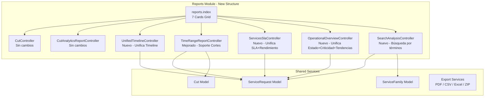

# Design Document: Report Ordering

## Overview

Este diseño describe la reorganización del módulo de Informes del sistema SAPP. El objetivo es consolidar 10+ tarjetas de informes en exactamente 7, unificando funcionalidades redundantes, mejorando informes existentes con soporte de cortes, y agregando un nuevo informe de búsqueda y análisis.

### Cambios principales:
1. **Conservar sin cambios**: Cortes e Informe Analítico por Corte
2. **Unificar Timeline**: Combinar "Timeline por Ticket" y "Línea de Tiempo" en una sola vista
3. **Mejorar Rango de Tiempo**: Agregar selector de cortes como fuente de fechas
4. **Unificar SLA + Rendimiento**: Nuevo informe "Servicios y SLA"
5. **Unificar Estado + Criticidad + Tendencias**: Nuevo informe "Panorama Operativo"
6. **Nuevo informe**: "Búsqueda y Análisis" por términos y tipos de servicio
7. **Actualizar índice**: Exactamente 7 tarjetas con grid responsivo

### Decisiones de diseño clave:
- Se reutilizan los controladores y lógica de consulta existentes, refactorizando en nuevos controladores unificados
- Se mantiene la arquitectura MVC de Laravel con Blade views
- Se conservan las dependencias existentes (DomPDF, Maatwebsite Excel, Carbon)
- Los informes eliminados del índice no se borran del código inmediatamente; sus rutas se deprecan pero se mantienen temporalmente para evitar errores 404 en bookmarks

## Architecture

### Diagrama de componentes



### Flujo de navegación

```mermaid
flowchart LR
    A[/reports] --> B{7 Cards}
    B --> C1[Cortes]
    B --> C2[Informe Analítico por Corte]
    B --> C3[Línea de Tiempo]
    B --> C4[Reporte por Rango de Tiempo]
    B --> C5[Servicios y SLA]
    B --> C6[Panorama Operativo]
    B --> C7[Búsqueda y Análisis]
    
    C3 --> D1[Lista paginada + Búsqueda por ticket]
    D1 --> D2[Detalle Timeline]
    D2 --> D3[Exportar PDF/Excel]
    
    C4 --> E1[Selector: Manual o por Corte]
    E1 --> E2[Generar PDF/Excel/ZIP]
    
    C5 --> F1[SLA Compliance + Performance]
    F1 --> F2[Exportar PDF/CSV]
    
    C6 --> G1[Estado + Criticidad + Tendencias]
    G1 --> G2[Exportar PDF/CSV]
    
    C7 --> H1[Búsqueda por términos/servicios]
    H1 --> H2[Resultados paginados + Resumen]
    H2 --> H3[Exportar PDF/CSV]
```

## Components and Interfaces

### 1. UnifiedTimelineController

Reemplaza `TimelineReportController` unificando la funcionalidad de "Línea de Tiempo" (listado paginado) y "Timeline por Ticket" (búsqueda directa por número).

```php
namespace App\Http\Controllers\Reports;

class UnifiedTimelineController extends Controller
{
    // Vista principal: lista paginada + campo de búsqueda por ticket
    public function index(Request $request): View;
    
    // Detalle de timeline de una solicitud
    public function show(int $id): View;
    
    // Búsqueda por ticket number (AJAX o form submit)
    public function searchByTicket(Request $request): RedirectResponse|JsonResponse;
    
    // Exportar timeline individual
    public function export(int $id, string $format): Response;
}
```

**Interfaz de la vista `index`:**
- Campo de búsqueda por ticket number (parcial o completo)
- Lista paginada de solicitudes (10 por página) filtrada por rango de fechas
- Default: mes actual cuando no se especifica rango
- Al buscar por ticket: redirige al detalle si se encuentra exactamente uno, o muestra resultados filtrados

### 2. TimeRangeReportController (Mejorado)

Se extiende el controlador existente para soportar selección de cortes como fuente de fechas.

```php
// Métodos nuevos/modificados en TimeRangeReportController:

public function index(): View
{
    // Ahora también carga los cortes disponibles del contrato activo
    $cuts = Cut::query()
        ->whereHas('contract', fn($q) => $q->where('company_id', session('current_company_id')))
        ->where('contract_id', $activeContract->id)
        ->orderByDesc('start_date')
        ->get();
    
    return view('reports.time-range.index', compact('families', 'cuts'));
}

public function generate(Request $request): Response
{
    // Validación extendida: acepta cut_id como alternativa a start_date/end_date
    // Si cut_id presente: usa fechas del corte y filtra por cut_service_request
}
```

**Nuevas reglas de validación:**
- `cut_id` y `start_date/end_date` son mutuamente excluyentes
- Si `cut_id` presente: se valida que el corte tenga solicitudes asociadas
- Si no hay cortes disponibles: se oculta la opción en la vista

### 3. ServicesSlaController (Nuevo)

Unifica "Cumplimiento de SLA" y "Rendimiento de Servicios" en un solo informe.

```php
namespace App\Http\Controllers\Reports;

class ServicesSlaController extends Controller
{
    public function index(Request $request): View
    {
        // Parámetros: date_from, date_to, requester_id, department
        // Default: últimos 30 días
        // Retorna: slaCompliance + servicePerformance combinados
    }
    
    public function export(Request $request, string $format): Response
    {
        // Formatos: pdf, csv
    }
}
```

**Datos retornados a la vista:**
- `slaCompliance`: Tasas de cumplimiento agrupadas por servicio y familia
- `servicePerformance`: Total requests, avg resolution time (hours), resolved count por servicio
- `filters`: date_from, date_to, requester_id, department
- `requesters`: Lista para el selector de filtro
- `departments`: Lista para el selector de filtro

### 4. OperationalOverviewController (Nuevo)

Unifica "Solicitudes por Estado", "Niveles de Criticidad" y "Tendencias Mensuales".

```php
namespace App\Http\Controllers\Reports;

class OperationalOverviewController extends Controller
{
    public function index(Request $request): View
    {
        // Parámetros: date_from, date_to (para estado/criticidad), months (para tendencias)
        // Defaults: 30 días para estado/criticidad, 12 meses para tendencias
        // months acepta: 3, 6, 12, 24
    }
    
    public function export(Request $request, string $format): Response
    {
        // Formatos: pdf, csv
    }
}
```

**Secciones de la vista:**
1. **Distribución por Estado**: status name, count, percentage (2 decimales)
2. **Distribución por Criticidad**: level, count, avg resolution time (hours, 1 decimal)
3. **Tendencias Mensuales**: month, total, resolved, completion rate, avg resolution time

### 5. SearchAnalysisController (Nuevo)

Nuevo informe de búsqueda por términos y tipos de servicio.

```php
namespace App\Http\Controllers\Reports;

class SearchAnalysisController extends Controller
{
    public function index(): View
    {
        // Muestra formulario de búsqueda con:
        // - Campo de texto para términos (separados por coma, max 10, max 100 chars c/u)
        // - Selector múltiple de familias/servicios/sub-servicios
    }
    
    public function search(Request $request): View
    {
        // Validación: al menos un término O un filtro de servicio
        // Búsqueda: case-insensitive, partial match, OR entre términos
        // Campos buscados: title, description, resolution_notes, requester.name, requester.email, requester.department
        // Si hay filtros de servicio: AND con los términos
        // Resultados paginados (50/página), ordenados por created_at desc
    }
    
    public function export(Request $request, string $format): Response
    {
        // Formatos: pdf, csv
    }
}
```

**Lógica de búsqueda:**
```
results = ServiceRequest WHERE (
    (title LIKE %term1% OR description LIKE %term1% OR ... ) OR
    (title LIKE %term2% OR description LIKE %term2% OR ... )
) AND (
    sub_service_id IN selected_sub_services OR
    service_id IN selected_services OR
    service_family_id IN selected_families
)
```

### 6. Reports Index (Actualizado)

El `ReportController::index()` se simplifica: ya no calcula estadísticas rápidas.

```php
public function index(): View
{
    return view('reports.index');
    // Sin datos adicionales - las tarjetas son estáticas con links
}
```

## Data Models

### Modelos existentes utilizados (sin cambios)

| Modelo | Uso en este feature |
|--------|-------------------|
| `ServiceRequest` | Fuente principal de datos para todos los informes |
| `Cut` | Selector de cortes en Time Range report |
| `ServiceFamily` | Filtro por familia en búsqueda y Time Range |
| `Service` | Filtro por servicio en búsqueda |
| `SubService` | Filtro por sub-servicio en búsqueda |
| `Requester` | Filtro por solicitante en Servicios y SLA |
| `Contract` | Relación con cortes para filtrar por workspace |

### Estructura de datos de respuesta por controlador

**ServicesSlaController - Datos de vista:**
```php
[
    'slaData' => [
        ['service_name' => string, 'family' => string, 'total_requests' => int, 
         'compliant' => int, 'overdue' => int, 'compliance_rate' => float],
        // ...
    ],
    'performanceData' => [
        ['service_name' => string, 'family_name' => string, 'total_requests' => int,
         'avg_resolution_hours' => float, 'resolved_count' => int],
        // ...
    ],
    'dateRange' => ['start' => Carbon, 'end' => Carbon],
    'requesters' => Collection<Requester>,
    'departments' => Collection<string>,
]
```

**OperationalOverviewController - Datos de vista:**
```php
[
    'statusData' => [
        ['status' => string, 'count' => int, 'percentage' => float],
        // ...
    ],
    'criticalityData' => [
        ['criticality_level' => string, 'count' => int, 'avg_resolution_hours' => float],
        // ...
    ],
    'trendsData' => [
        ['month' => string, 'total_requests' => int, 'resolved_requests' => int,
         'completion_rate' => float, 'avg_resolution_hours' => float],
        // ...
    ],
    'dateRange' => ['start' => Carbon, 'end' => Carbon],
    'months' => int,
    'allowedMonths' => [3, 6, 12, 24],
]
```

**SearchAnalysisController - Datos de vista:**
```php
[
    'results' => LengthAwarePaginator<ServiceRequest>,  // 50 por página
    'summary' => [
        'total_matches' => int,
        'by_status' => ['status_name' => count, ...],
        'by_family' => ['family_name' => count, ...],
        'by_criticality' => ['level' => count, ...],
    ],
    'searchTerms' => array<string>,
    'selectedServiceTypes' => array<int>,
    'families' => Collection<ServiceFamily>,
    'services' => Collection<Service>,
    'subServices' => Collection<SubService>,
]
```

### Nuevas rutas

```php
// routes/features/reporting/web.php - Nuevas rutas

// Línea de Tiempo unificada (reemplaza timeline.index y timeline.by-ticket)
Route::prefix('timeline')->name('timeline.')->group(function () {
    Route::get('/', [UnifiedTimelineController::class, 'index'])->name('index');
    Route::get('/detail/{id}', [UnifiedTimelineController::class, 'show'])->name('show');
    Route::post('/search', [UnifiedTimelineController::class, 'searchByTicket'])->name('search');
    Route::get('/export/{id}/{format}', [UnifiedTimelineController::class, 'export'])->name('export');
});

// Servicios y SLA (reemplaza sla-compliance y service-performance)
Route::prefix('services-sla')->name('services-sla.')->group(function () {
    Route::get('/', [ServicesSlaController::class, 'index'])->name('index');
    Route::get('/export/{format}', [ServicesSlaController::class, 'export'])->name('export');
});

// Panorama Operativo (reemplaza requests-by-status, criticality-levels, monthly-trends)
Route::prefix('operational-overview')->name('operational-overview.')->group(function () {
    Route::get('/', [OperationalOverviewController::class, 'index'])->name('index');
    Route::get('/export/{format}', [OperationalOverviewController::class, 'export'])->name('export');
});

// Búsqueda y Análisis (nuevo)
Route::prefix('search-analysis')->name('search-analysis.')->group(function () {
    Route::get('/', [SearchAnalysisController::class, 'index'])->name('index');
    Route::get('/search', [SearchAnalysisController::class, 'search'])->name('search');
    Route::get('/export/{format}', [SearchAnalysisController::class, 'export'])->name('export');
});
```

## Correctness Properties

*A property is a characteristic or behavior that should hold true across all valid executions of a system—essentially, a formal statement about what the system should do. Properties serve as the bridge between human-readable specifications and machine-verifiable correctness guarantees.*

### Property 1: Ticket search partial match

*For any* service request with a ticket number, and any substring of that ticket number used as a search term, the unified timeline search SHALL return that service request in its results.

**Validates: Requirements 2.2**

### Property 2: Timeline pagination respects page size and date range

*For any* set of service requests and any date range filter, the unified timeline list SHALL return at most 10 items per page, and every returned item SHALL have a `created_at` within the specified date range.

**Validates: Requirements 2.3**

### Property 3: Cut-based and family filtering constrains results

*For any* cut selected as date range source and any set of selected service families, the Time Range report results SHALL only contain service requests that are associated with the selected cut (via cut_service_request) AND belong to at least one of the selected service families.

**Validates: Requirements 3.4, 3.7**

### Property 4: SLA compliance and performance metrics correctness

*For any* set of service requests grouped by service, the compliance_rate SHALL equal `(count of non-overdue requests / total requests) * 100` rounded to 2 decimal places, and the avg_resolution_hours SHALL equal the arithmetic mean of `TIMESTAMPDIFF(HOUR, responded_at or created_at, resolved_at or NOW())` across all requests in the group.

**Validates: Requirements 4.2, 4.3**

### Property 5: Filter application constrains results in Services and SLA report

*For any* combination of date range, requester, and department filters applied to the Services and SLA report, every service request included in the results SHALL have `created_at` within the date range, AND match the requester filter (if specified), AND match the department filter (if specified).

**Validates: Requirements 4.4**

### Property 6: Status and criticality percentage calculations

*For any* set of service requests within a date range, the status distribution percentages SHALL each equal `(status_count / total) * 100` rounded to 2 decimal places, and the monthly completion_rate SHALL equal `(count of RESUELTA or CERRADA requests / total requests in that month) * 100` rounded to 2 decimal places.

**Validates: Requirements 5.2, 5.3, 5.4**

### Property 7: Search input validation

*For any* input string split by commas, if the resulting array has more than 10 elements OR any element (after trimming) exceeds 100 characters, the Search and Analysis report SHALL reject the input with a validation error. If the array has 1-10 elements each with 1-100 characters, the input SHALL be accepted.

**Validates: Requirements 6.2**

### Property 8: Search results contain matching terms

*For any* search term and any service request returned in the results, that service request SHALL contain the search term (case-insensitive partial match) in at least one of: title, description, resolution_notes, requester.name, requester.email, or requester.department. Additionally, the summary total_matches SHALL equal the total count of matching results.

**Validates: Requirements 6.4, 6.6**

### Property 9: Multi-term OR logic produces union

*For any* two search terms A and B, the result set of searching for "A, B" (both terms) SHALL equal the union of the result set of searching for "A" alone and the result set of searching for "B" alone.

**Validates: Requirements 6.5**

### Property 10: Combined search filters produce intersection

*For any* set of search terms and any set of selected service types, the result set SHALL equal the intersection of: (results matching at least one search term) AND (results belonging to at least one selected service type).

**Validates: Requirements 6.8**

### Property 11: Search pagination and ordering

*For any* search result set, each page SHALL contain at most 50 items, and items within each page SHALL be ordered by `created_at` descending (i.e., for consecutive items i and i+1, `items[i].created_at >= items[i+1].created_at`).

**Validates: Requirements 6.7**

## Error Handling

### Validation Errors

| Controller | Scenario | Response |
|-----------|----------|----------|
| UnifiedTimelineController | Empty ticket search | Show all results (no filter applied) |
| UnifiedTimelineController | Ticket not found | Flash message: "No se encontró ninguna solicitud con ese número de ticket" |
| TimeRangeReportController | Cut with no requests | Flash error + prevent generation |
| TimeRangeReportController | Invalid date range (start > end) | Swap dates automatically |
| ServicesSlaController | No data for filters | Show empty state message |
| OperationalOverviewController | Invalid months param | Default to 12 |
| OperationalOverviewController | No data for period | Show empty state message |
| SearchAnalysisController | No terms AND no service types | Validation error: "Ingrese al menos un término o seleccione un tipo de servicio" |
| SearchAnalysisController | More than 10 terms | Validation error: "Máximo 10 términos de búsqueda" |
| SearchAnalysisController | Term > 100 chars | Validation error: "Cada término debe tener máximo 100 caracteres" |
| SearchAnalysisController | No results | Show message with applied terms/filters |

### Export Errors

- **PDF generation failure**: Catch exception, flash error message, redirect back
- **Excel/CSV generation failure**: Catch exception, flash error message, redirect back
- **ZIP creation failure** (missing php-zip): Show specific message about missing extension
- **Empty data export**: Allow export with empty data (generates file with headers only)

### Authorization

- All report controllers check `session('current_company_id')` to scope data to current workspace
- Cut-related operations verify the cut belongs to the current workspace's active contract
- No new permissions are introduced; existing auth middleware applies

## Testing Strategy

### Unit Tests (Example-based)

Focus on specific scenarios and edge cases:

1. **Index page structure**: Verify exactly 7 cards, correct order, correct routes, removed cards absent
2. **Responsive grid classes**: Verify correct Tailwind classes for responsive layout
3. **Card colors**: Verify each card has a unique border color
4. **Default date ranges**: Verify correct defaults when no parameters provided
5. **Empty state messages**: Verify correct messages for each empty scenario
6. **Export format availability**: Verify each report offers its specified formats
7. **Cut selector visibility**: Hidden when no cuts exist, visible otherwise
8. **Months configuration**: Only accepts 3, 6, 12, 24; defaults to 12

### Property-Based Tests

Using [Pest PHP](https://pestphp.com/) with the `pest-plugin-faker` for data generation. Each property test runs minimum 100 iterations.

**Library**: `pestphp/pest` with custom generators for ServiceRequest, Cut, and related models.

**Configuration**: Each test tagged with feature and property reference:
```php
// Feature: report-ordering, Property 1: Ticket search partial match
test('ticket search partial match', function () { ... })->repeat(100);
```

Properties to implement:
- Property 1: Ticket search partial match
- Property 2: Timeline pagination page size and date range
- Property 3: Cut-based and family filtering
- Property 4: SLA compliance and performance metrics
- Property 5: Filter application in Services and SLA
- Property 6: Status/criticality percentage calculations
- Property 7: Search input validation
- Property 8: Search results contain matching terms
- Property 9: Multi-term OR logic (union)
- Property 10: Combined filters (intersection)
- Property 11: Search pagination and ordering

### Integration Tests

1. **Route accessibility**: All new routes respond with 200 for authenticated users
2. **Old route deprecation**: Old routes redirect or return appropriate responses
3. **Export file generation**: PDF and CSV files are generated without errors
4. **Database queries**: Verify queries respect workspace scoping via company_id
5. **Cut-TimeRange integration**: Selecting a cut correctly populates dates and filters requests

