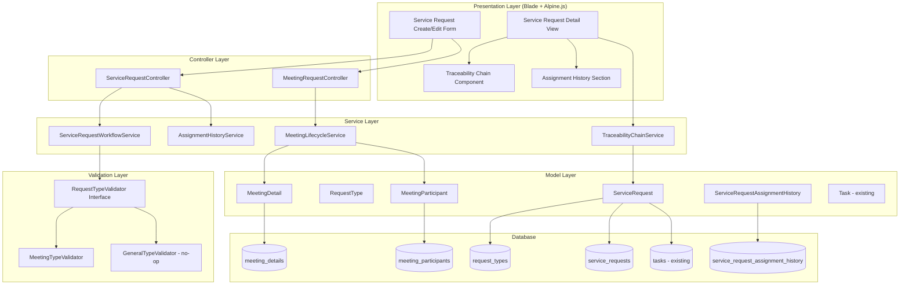
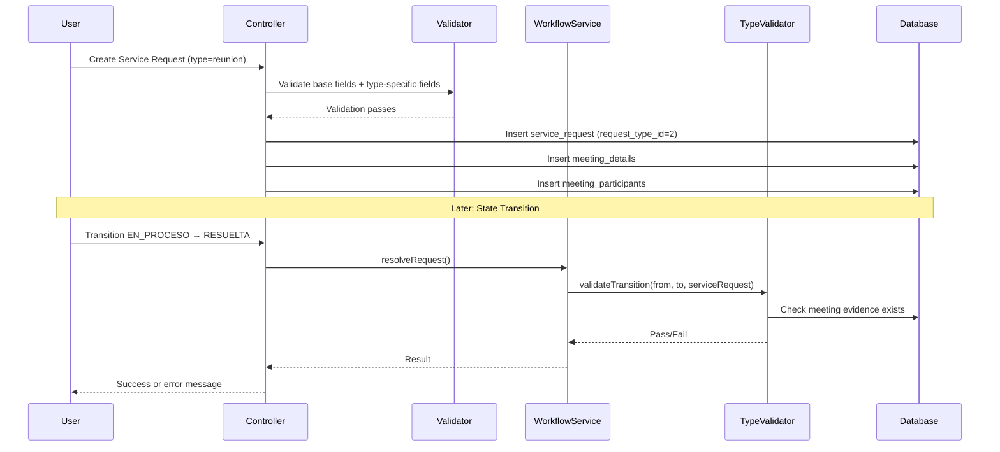
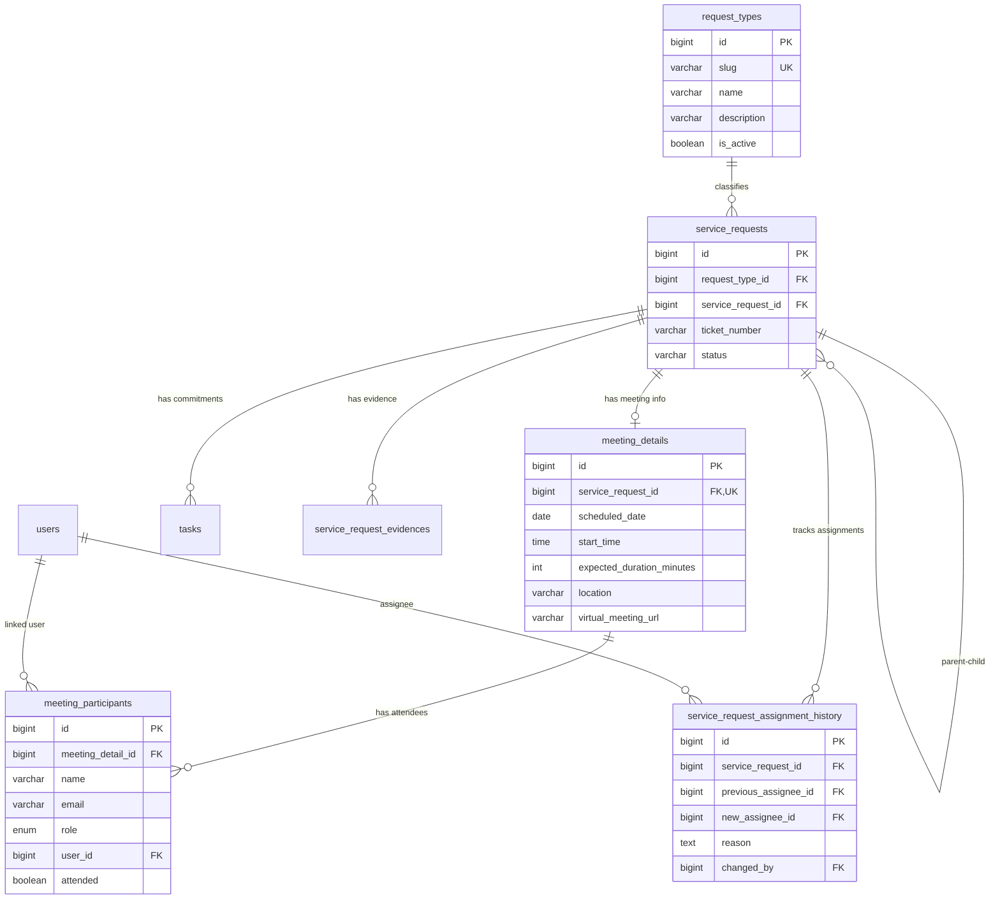

# Design Document: Request Type Classification

## Overview

This design introduces a request type classification system to the SAPP service request platform. It allows different types of requests (meetings, commitments, follow-ups, document requests) to have distinct lifecycle behaviors while preserving backward compatibility with the 80+ existing migrations and current workflow.

The system is additive: new tables and models are introduced alongside the existing `ServiceRequest` model. The existing `ServiceRequestWorkflow` trait gains a hook for type-specific validations without modifying its core state machine. All existing requests continue to function as "general" (null type) with no behavioral changes.

### Key Design Decisions

1. **Nullable FK strategy**: The `request_type_id` column on `service_requests` is nullable with no default — existing rows remain null, interpreted as "general".
2. **Dedicated tables for meeting data**: `meeting_details` and `meeting_participants` are linked via FK to `service_requests` rather than embedding JSON, enabling proper querying and constraints.
3. **Type-specific validation via strategy pattern**: A `RequestTypeValidator` interface allows each type to inject transition-specific rules into the existing workflow trait without modifying the base state transitions.
4. **Commitments as Tasks**: Meeting commitments leverage the existing `Task` model with `type = 'impact'` and the existing `service_request_id` FK, avoiding new tables.
5. **Self-referencing FK for traceability**: A `service_request_id` nullable column on `service_requests` enables parent-child relationships using the existing `childRequests`/`parentRequest` Eloquent relationships.
6. **Assignment history as a separate table**: `service_request_assignment_history` captures every reassignment event independently from the evidence system, while also creating a system evidence record for consistency.

## Architecture



### Request Flow



## Components and Interfaces

### New Models

#### `RequestType` Model
- Table: `request_types`
- Attributes: `id`, `slug`, `name`, `description`, `is_active`, `timestamps`
- Scopes: `active()`, `bySlug($slug)`
- Relationships: `serviceRequests()`

#### `MeetingDetail` Model
- Table: `meeting_details`
- Attributes: `id`, `service_request_id`, `scheduled_date`, `start_time`, `expected_duration_minutes`, `location`, `virtual_meeting_url`, `timestamps`
- Relationships: `serviceRequest()`, `participants()`
- Accessors: `end_time` (computed from start_time + duration)

#### `MeetingParticipant` Model
- Table: `meeting_participants`
- Attributes: `id`, `meeting_detail_id`, `name`, `email`, `role` (enum: organizador, participante, invitado), `user_id` (nullable), `attended` (boolean, nullable), `timestamps`
- Relationships: `meetingDetail()`, `user()`
- Scopes: `organizers()`, `attended()`

#### `ServiceRequestAssignmentHistory` Model
- Table: `service_request_assignment_history`
- Attributes: `id`, `service_request_id`, `previous_assignee_id` (nullable), `new_assignee_id`, `reason`, `changed_by`, `timestamps`
- Relationships: `serviceRequest()`, `previousAssignee()`, `newAssignee()`, `changedBy()`

### Modified Models

#### `ServiceRequest` (additive changes only)
- New nullable column: `request_type_id` (FK → `request_types.id`)
- New nullable column: `service_request_id` (FK → `service_requests.id`, self-referencing)
- New relationships: `requestType()`, `meetingDetail()`, `assignmentHistories()`
- Existing relationships used: `childRequests()`, `parentRequest()`, `tasks()`, `evidences()`

### Service Interfaces

#### `RequestTypeValidatorInterface`
```php
interface RequestTypeValidatorInterface
{
    public function validateTransition(ServiceRequest $sr, string $from, string $to): ValidationResult;
    public function getRequiredFieldsForCreation(): array;
}
```

#### `MeetingLifecycleService`
- `createMeetingDetails(ServiceRequest $sr, array $data): MeetingDetail`
- `updateMeetingDetails(MeetingDetail $md, array $data): MeetingDetail`
- `addParticipant(MeetingDetail $md, array $data): MeetingParticipant`
- `removeParticipant(MeetingParticipant $mp): void`
- `markAttendance(MeetingParticipant $mp, bool $attended): void`
- `getCommitments(ServiceRequest $sr): Collection`
- `createCommitment(ServiceRequest $sr, array $data): Task`

#### `AssignmentHistoryService`
- `recordAssignment(ServiceRequest $sr, ?int $previousId, int $newId, string $reason, int $changedBy): ServiceRequestAssignmentHistory`
- `getHistory(ServiceRequest $sr): Collection`
- `transferTasks(ServiceRequest $sr, int $fromTechnicianId, int $toTechnicianId): int`

#### `TraceabilityChainService`
- `buildChain(ServiceRequest $sr, int $maxDepth = 3): array`
- `getChainForView(ServiceRequest $sr): array` (includes commitments as nodes)

### New Controllers

#### `MeetingRequestController`
Handles meeting-specific operations (participant management, attendance, commitment creation) as sub-routes of service requests.

### Modified Controllers

#### `ServiceRequestController`
- `store()` method extended to handle `request_type_id` and delegate to `MeetingLifecycleService` when type is "reunion"
- `reassignSubmit()` method enhanced to call `AssignmentHistoryService`
- `show()` method enhanced to load traceability chain and assignment history

### Validation (Form Requests)

#### `StoreServiceRequestRequest` (modified)
- Add optional `request_type_id` validation
- Conditionally require meeting fields when type slug = "reunion"

#### `StoreMeetingParticipantRequest` (new)
- Validates participant name, email, role
- Validates email uniqueness within the meeting

#### `StoreCommitmentRequest` (new)
- Validates title, description, responsible person, due date

## Data Models

### Database Schema

#### `request_types` table (new)
```sql
CREATE TABLE request_types (
    id BIGINT UNSIGNED AUTO_INCREMENT PRIMARY KEY,
    slug VARCHAR(50) NOT NULL UNIQUE,
    name VARCHAR(100) NOT NULL,
    description VARCHAR(500) NULL,
    is_active BOOLEAN NOT NULL DEFAULT TRUE,
    created_at TIMESTAMP NULL,
    updated_at TIMESTAMP NULL
);
```

Seeded with:
| slug | name | is_active |
|------|------|-----------|
| general | General | true |
| reunion | Reunión | true |
| compromiso | Compromiso | true |
| seguimiento | Seguimiento | true |
| solicitud_documental | Solicitud Documental | true |

#### `service_requests` table (additive columns)
```sql
ALTER TABLE service_requests
    ADD COLUMN request_type_id BIGINT UNSIGNED NULL AFTER company_id,
    ADD COLUMN service_request_id BIGINT UNSIGNED NULL AFTER request_type_id,
    ADD CONSTRAINT fk_sr_request_type FOREIGN KEY (request_type_id) REFERENCES request_types(id),
    ADD CONSTRAINT fk_sr_parent_request FOREIGN KEY (service_request_id) REFERENCES service_requests(id) ON DELETE SET NULL;
```

#### `meeting_details` table (new)
```sql
CREATE TABLE meeting_details (
    id BIGINT UNSIGNED AUTO_INCREMENT PRIMARY KEY,
    service_request_id BIGINT UNSIGNED NOT NULL,
    scheduled_date DATE NOT NULL,
    start_time TIME NOT NULL,
    expected_duration_minutes INT UNSIGNED NOT NULL,
    location VARCHAR(255) NULL,
    virtual_meeting_url VARCHAR(2048) NULL,
    created_at TIMESTAMP NULL,
    updated_at TIMESTAMP NULL,
    CONSTRAINT fk_md_service_request FOREIGN KEY (service_request_id) REFERENCES service_requests(id) ON DELETE CASCADE,
    UNIQUE KEY uq_md_service_request (service_request_id)
);
```

#### `meeting_participants` table (new)
```sql
CREATE TABLE meeting_participants (
    id BIGINT UNSIGNED AUTO_INCREMENT PRIMARY KEY,
    meeting_detail_id BIGINT UNSIGNED NOT NULL,
    name VARCHAR(255) NOT NULL,
    email VARCHAR(255) NOT NULL,
    role ENUM('organizador', 'participante', 'invitado') NOT NULL DEFAULT 'participante',
    user_id BIGINT UNSIGNED NULL,
    attended BOOLEAN NULL,
    created_at TIMESTAMP NULL,
    updated_at TIMESTAMP NULL,
    CONSTRAINT fk_mp_meeting_detail FOREIGN KEY (meeting_detail_id) REFERENCES meeting_details(id) ON DELETE CASCADE,
    CONSTRAINT fk_mp_user FOREIGN KEY (user_id) REFERENCES users(id) ON DELETE SET NULL,
    UNIQUE KEY uq_mp_email_meeting (meeting_detail_id, email)
);
```

#### `service_request_assignment_history` table (new)
```sql
CREATE TABLE service_request_assignment_history (
    id BIGINT UNSIGNED AUTO_INCREMENT PRIMARY KEY,
    service_request_id BIGINT UNSIGNED NOT NULL,
    previous_assignee_id BIGINT UNSIGNED NULL,
    new_assignee_id BIGINT UNSIGNED NOT NULL,
    reason TEXT NOT NULL,
    changed_by BIGINT UNSIGNED NOT NULL,
    created_at TIMESTAMP NULL,
    updated_at TIMESTAMP NULL,
    CONSTRAINT fk_srah_service_request FOREIGN KEY (service_request_id) REFERENCES service_requests(id) ON DELETE CASCADE,
    CONSTRAINT fk_srah_previous_assignee FOREIGN KEY (previous_assignee_id) REFERENCES users(id) ON DELETE SET NULL,
    CONSTRAINT fk_srah_new_assignee FOREIGN KEY (new_assignee_id) REFERENCES users(id) ON DELETE SET NULL,
    CONSTRAINT fk_srah_changed_by FOREIGN KEY (changed_by) REFERENCES users(id) ON DELETE SET NULL,
    INDEX idx_srah_service_request (service_request_id),
    INDEX idx_srah_created_at (created_at)
);
```

### Entity Relationship Diagram



## Correctness Properties

*A property is a characteristic or behavior that should hold true across all valid executions of a system — essentially, a formal statement about what the system should do. Properties serve as the bridge between human-readable specifications and machine-verifiable correctness guarantees.*

### Property 1: Slug format validation

*For any* string submitted as a request type slug, the validator SHALL accept it if and only if it matches the pattern `^[a-z0-9_]{1,50}$` (lowercase alphanumeric and underscores, 1–50 characters).

**Validates: Requirements 1.1**

### Property 2: Slug uniqueness enforcement

*For any* valid slug that already exists in the `request_types` table, attempting to create a new request type with that same slug SHALL be rejected with an error.

**Validates: Requirements 1.6**

### Property 3: Inactive type blocks new request creation

*For any* request type with `is_active = false`, attempting to create a new service request referencing that type SHALL be rejected, while all existing service requests of that type SHALL remain unchanged (same status, same fields).

**Validates: Requirements 1.4, 1.8, 2.5**

### Property 4: Type immutability after creation

*For any* service request with a non-null `request_type_id`, attempting to update the `request_type_id` to any different value (including null) SHALL be rejected.

**Validates: Requirements 2.6**

### Property 5: Null-type requests bypass type-specific validations

*For any* service request with a null `request_type_id` and any valid state transition, the transition SHALL succeed without requiring meeting evidence, attendance records, or scheduling fields — executing only the standard workflow rules.

**Validates: Requirements 2.3, 3.2**

### Property 6: Priority scoring independence from request type

*For any* service request data (sub_service, criticality_level, thread_count, distrust_factor), the computed priority_score SHALL be identical regardless of whether `request_type_id` is null, references "general", or references "reunion".

**Validates: Requirements 3.5**

### Property 7: Meeting scheduling field validation

*For any* meeting request creation attempt, the validation SHALL accept the scheduling data if and only if: scheduled_date >= current date, start_time is present, and 5 <= expected_duration_minutes <= 480.

**Validates: Requirements 4.1, 4.5**

### Property 8: Meeting details editability by status

*For any* meeting request, editing scheduling details (date, time, duration, location, URL) SHALL succeed if the request's status is PENDIENTE, and SHALL be rejected for any other status.

**Validates: Requirements 4.4, 4.6, 10.4**

### Property 9: Participant email uniqueness within a meeting

*For any* meeting detail with an existing set of participants, adding a new participant whose email matches any existing participant's email in the same meeting SHALL be rejected.

**Validates: Requirements 5.6**

### Property 10: Organizador required for meeting transition from PENDIENTE

*For any* meeting request in status PENDIENTE with any set of participants, the transition to ACEPTADA SHALL succeed only if at least one participant has the role "organizador"; otherwise the transition SHALL be blocked.

**Validates: Requirements 5.4**

### Property 11: Participant user auto-linking

*For any* participant added with an email that matches an existing user's email in the system, the saved `MeetingParticipant` record SHALL have its `user_id` field set to that user's ID.

**Validates: Requirements 5.5**

### Property 12: Meeting evidence required for resolution

*For any* meeting request attempting the transition from EN_PROCESO to RESUELTA, the transition SHALL succeed only if at least one `ServiceRequestEvidence` record of type ARCHIVO, ACTA, or ENLACE exists for that request.

**Validates: Requirements 6.3, 10.1**

### Property 13: ACTA MIME type validation

*For any* file upload with evidence_type "ACTA", the validation SHALL accept the file if and only if its MIME type is one of: application/pdf, application/vnd.openxmlformats-officedocument.wordprocessingml.document, image/jpeg, image/jpg, or image/png.

**Validates: Requirements 6.5**

### Property 14: Attendance required for meeting closure

*For any* meeting request attempting the transition from RESUELTA to CERRADA, the transition SHALL succeed only if at least one participant in the `meeting_participants` table has `attended = true`.

**Validates: Requirements 10.2, 10.6**

### Property 15: State preservation on failed type-specific validation

*For any* meeting request where a type-specific validation fails during a state transition, the request's status SHALL remain equal to its status before the attempted transition.

**Validates: Requirements 10.5**

### Property 16: Commitment creates impact task with correct parent

*For any* commitment created from a meeting request, the resulting Task record SHALL have `type = 'impact'` and `service_request_id` equal to the meeting request's ID.

**Validates: Requirements 7.3**

### Property 17: Commitment field validation

*For any* commitment creation data, validation SHALL pass if and only if: title length is 1–255 characters, description length is 1–2000 characters, a responsible technician is assigned, and due_date >= current date.

**Validates: Requirements 7.2**

### Property 18: Derived request stores parent FK

*For any* derived request created from an existing parent service request, the `service_request_id` column SHALL equal the parent's ID.

**Validates: Requirements 8.1**

### Property 19: Derived request form pre-population

*For any* parent service request, the pre-populated form data for creating a derived request SHALL have `company_id`, `requester_id`, and family values matching the parent's corresponding fields.

**Validates: Requirements 8.4**

### Property 20: Traceability chain depth limiting

*For any* service request tree with depth exceeding 3 child levels below the root, the `buildChain` service SHALL return at most 3 levels of children, and nodes at the maximum depth with hidden children SHALL include a count of those hidden children.

**Validates: Requirements 9.2, 9.3**

### Property 21: Traceability chain node completeness

*For any* service request included in a traceability chain, the chain node data SHALL contain: ticket_number, title, status, type_label (derived from request type slug or "general"), assigned technician name (or "Sin asignar"), and created_at.

**Validates: Requirements 9.4**

### Property 22: Assignment history record completeness

*For any* reassignment operation, the system SHALL create a `ServiceRequestAssignmentHistory` record containing non-null values for: service_request_id, new_assignee_id, reason, changed_by, and created_at.

**Validates: Requirements 11.1**

### Property 23: Assignment history chronological ordering

*For any* service request with multiple assignment history records, retrieving the history SHALL return records sorted by `created_at` in ascending order (oldest first).

**Validates: Requirements 11.3**

### Property 24: Reassignment status guard

*For any* service request in a status NOT in {PENDIENTE, ACEPTADA, EN_PROCESO, PAUSADA}, attempting to reassign it SHALL be rejected with an error.

**Validates: Requirements 11.5**

### Property 25: Task transfer on reassignment

*For any* service request with tasks in mixed statuses being reassigned, only tasks with status in {pending, in_progress, blocked, in_review} SHALL have their `technician_id` updated to the new technician, while tasks with status in {completed, cancelled, rescheduled} SHALL remain unchanged.

**Validates: Requirements 11.6, 11.8**

### Property 26: Reassignment reason length validation

*For any* reassignment reason string, the system SHALL accept it if and only if its character length is between 10 and 500 (inclusive).

**Validates: Requirements 11.7**

## Error Handling

### Validation Errors

| Scenario | Error Message (es) | HTTP Status |
|----------|-------------------|-------------|
| Invalid slug format | "El slug solo puede contener letras minúsculas, números y guiones bajos (1-50 caracteres)." | 422 |
| Duplicate slug | "El slug '{slug}' ya está en uso." | 422 |
| Inactive type on creation | "El tipo de solicitud seleccionado no está disponible." | 422 |
| Type change attempt | "No se puede cambiar el tipo de una solicitud después de su creación." | 422 |
| Missing meeting fields | "Los campos de programación son obligatorios para reuniones: {fields}." | 422 |
| Meeting edit in wrong status | "Los detalles de la reunión solo pueden editarse mientras la solicitud está en estado PENDIENTE." | 422 |
| Duplicate participant email | "El correo {email} ya está registrado como participante de esta reunión." | 422 |
| Missing organizador | "Se requiere al menos un participante con rol 'organizador' para continuar." | 422 |
| Missing evidence for resolution | "Se requiere al menos una evidencia (archivo, acta o enlace) para resolver una solicitud de reunión." | 422 |
| Missing attendance for closure | "Se requiere que al menos un participante tenga asistencia confirmada para cerrar la reunión." | 422 |
| Invalid ACTA MIME type | "El tipo de archivo para actas debe ser PDF, DOCX, JPG, JPEG o PNG." | 422 |
| Invalid parent for derived request | "La solicitud padre especificada no existe o ha sido eliminada." | 422 |
| Reassignment in invalid status | "No se puede reasignar una solicitud en estado {status}." | 422 |
| Reason too short/long | "La razón de reasignación debe tener entre 10 y 500 caracteres." | 422 |
| Commitment missing fields | "Faltan campos obligatorios: {fields}." | 422 |
| Deactivating "general" type | "No se puede desactivar el tipo 'general'." | 422 |

### Exception Handling Strategy

- **Database constraint violations** (duplicate slug, FK violations): Caught in service layer, converted to user-friendly validation errors. Transaction is rolled back.
- **Workflow state violations**: The `ServiceRequestWorkflow` trait throws exceptions on invalid transitions. The `RequestTypeValidator` adds meeting-specific checks before the base validation runs. If type-specific validation fails, the exception is thrown before any state change occurs.
- **File upload failures**: The existing `EvidenceService` handles storage errors. The ACTA MIME validation is added as a rule in the upload validation layer.
- **Concurrent assignment conflicts**: The `AssignmentHistoryService` wraps the assignment + task transfer + history creation in a DB transaction with a `lockForUpdate()` on the service request row to prevent race conditions.

### Graceful Degradation

- If the `request_types` table is empty or unreachable, the system falls back to treating all requests as null-type (general workflow).
- If a meeting_detail record is somehow orphaned (FK deleted), the detail view shows "Información de reunión no disponible" without crashing.
- If the traceability chain query times out (deeply nested trees), the service returns a partial result with a truncation indicator.

## Testing Strategy

### Unit Tests (PHPUnit)

Focus on specific examples, edge cases, and integration points:

- **RequestType model**: CRUD operations, scope methods, seeder validation
- **MeetingDetail/MeetingParticipant models**: Relationship loading, accessor computation
- **ServiceRequestWorkflow trait**: Verify that adding type-specific validators doesn't break existing transition tests
- **Form Request validation**: Specific invalid input scenarios (empty title, past date, invalid MIME types)
- **TraceabilityChainService**: Specific tree structures (single child, max depth, orphaned nodes)
- **AssignmentHistoryService**: Reassignment with/without tasks, boundary cases

### Property-Based Tests (PBT)

**Library**: [quickcheck/phpquickcheck](https://github.com/steos/php-quickcheck) — a PHP property-based testing library compatible with PHPUnit.

**Configuration**: Minimum 100 iterations per property test.

**Tag format**: `Feature: request-type-classification, Property {N}: {property_text}`

Each correctness property from the design document will be implemented as a single property-based test with generators for:
- Random slug strings (valid and invalid)
- Random meeting scheduling data (dates, durations)
- Random participant lists (varying sizes, roles, emails)
- Random service request states and transition sequences
- Random task sets with mixed statuses
- Random traceability trees with varying depth

### Integration Tests

- Report queries include both null-type and typed requests (Requirement 3.3)
- Smart Request Parser continues producing null-type requests (Requirement 3.4)
- Meeting workflow end-to-end: creation → scheduling → participants → evidence → resolution → closure
- Derived request creation from meeting with task reference in evidence_data
- Existing reassignment flow produces assignment history records

### Migration Tests

- Verify `request_types` table is created with correct schema
- Verify `service_requests` additive columns are nullable and don't affect existing rows
- Verify `meeting_details` and `meeting_participants` tables have correct FKs
- Verify `service_request_assignment_history` table is created
- Verify seeder populates required type slugs

### N+1 Prevention (Traceability Chain)

The `TraceabilityChainService.buildChain()` method uses eager loading with constrained depth:

```php
$serviceRequest->load([
    'childRequests' => function ($query) {
        $query->select(['id', 'service_request_id', 'ticket_number', 'title', 'status', 'request_type_id', 'assigned_to', 'created_at'])
              ->with(['requestType:id,slug,name', 'assignee:id,name'])
              ->limit(50);
    },
    'childRequests.childRequests' => function ($query) {
        $query->select(['id', 'service_request_id', 'ticket_number', 'title', 'status', 'request_type_id', 'assigned_to', 'created_at'])
              ->with(['requestType:id,slug,name', 'assignee:id,name'])
              ->limit(50);
    },
    'childRequests.childRequests.childRequests' => function ($query) {
        $query->select(['id', 'service_request_id', 'ticket_number', 'title', 'status', 'request_type_id', 'assigned_to', 'created_at'])
              ->withCount('childRequests')
              ->limit(50);
    },
    'tasks' => function ($query) {
        $query->where('type', 'impact')
              ->select(['id', 'service_request_id', 'title', 'status', 'technician_id', 'created_at'])
              ->with('technician.user:id,name');
    },
    'requestType:id,slug,name',
    'assignee:id,name',
    'meetingDetail.participants',
]);
```

This ensures a fixed number of queries regardless of tree size (3 levels × 1 query each + commitments query + relationship queries = ~8 queries total).

