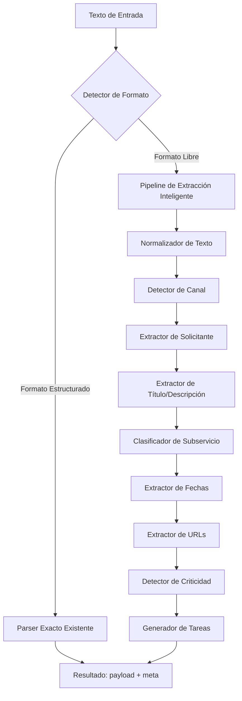
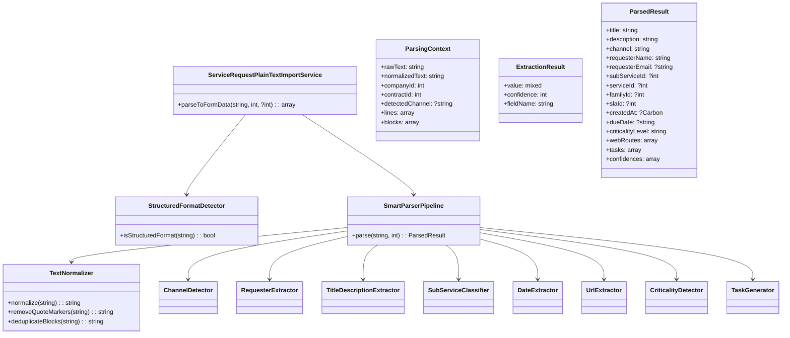

# Design Document

## Overview

Este documento describe el diseño técnico del **Parser Inteligente de Solicitudes**, una evolución del servicio existente `ServiceRequestPlainTextImportService` que amplía su capacidad para interpretar texto libre proveniente de correos electrónicos y mensajes de WhatsApp. El sistema actual solo reconoce un formato estructurado predefinido; el nuevo diseño introduce un pipeline de parsing modular que detecta el formato del texto de entrada y aplica estrategias de extracción apropiadas para cada campo de la solicitud de servicio.

La arquitectura se basa en el patrón **Strategy + Pipeline**: un orquestador central delega la extracción de cada campo a extractores especializados que operan de forma independiente. Esto permite agregar nuevos canales o reglas de extracción sin modificar el flujo principal.

**Decisiones clave de diseño:**
- Se mantiene la interfaz pública `parseToFormData()` sin cambios para garantizar compatibilidad con el controlador existente.
- El formato estructurado existente se detecta primero y se procesa con el algoritmo original intacto.
- Cada extractor reporta un nivel de confianza (0-100%) por campo extraído.
- El sistema es tolerante a fallos parciales: si un campo no puede extraerse, los demás continúan procesándose.

## Architecture

La arquitectura sigue un diseño de pipeline secuencial con extractores independientes:



**Capas del sistema:**

1. **Capa de Entrada (Controller):** `ServiceRequestController::prefillFromPlainText()` — sin cambios en la interfaz.
2. **Capa de Orquestación (Service):** `ServiceRequestPlainTextImportService::parseToFormData()` — punto de entrada que decide la estrategia.
3. **Capa de Detección de Formato:** `StructuredFormatDetector` — determina si el texto sigue el formato exacto existente.
4. **Capa de Normalización:** `TextNormalizer` — limpia y prepara el texto para extracción.
5. **Capa de Extracción (Extractors):** Clases especializadas por campo, cada una con su lógica de pattern matching.
6. **Capa de Resolución (Resolvers):** Clases que resuelven entidades contra la base de datos (solicitante, subservicio, SLA).

## Components and Interfaces

### 1. ServiceRequestPlainTextImportService (Modificado)

Mantiene la interfaz pública existente y actúa como orquestador:

```php
class ServiceRequestPlainTextImportService
{
    public function __construct(
        private readonly ServiceRequestService $serviceRequestService,
        private readonly SmartParserPipeline $smartPipeline,
        private readonly StructuredFormatDetector $formatDetector,
    ) {}

    /**
     * Interfaz pública sin cambios.
     * @return array{payload: array, meta: array}
     */
    public function parseToFormData(string $plainText, int $companyId, ?int $requestedBy = null): array;
}
```

### 2. StructuredFormatDetector

Determina si el texto sigue el formato estructurado existente:

```php
class StructuredFormatDetector
{
    /**
     * Retorna true si el texto coincide con el formato exacto predefinido.
     */
    public function isStructuredFormat(string $normalizedText): bool;
}
```

### 3. TextNormalizer

Limpia y normaliza el texto de entrada antes de la extracción:

```php
class TextNormalizer
{
    /**
     * Normaliza el texto: elimina caracteres de control, colapsa saltos de línea,
     * reemplaza tabulaciones, elimina marcadores de citado, deduplica bloques.
     */
    public function normalize(string $rawText): string;
    
    /**
     * Elimina líneas citadas (prefijo ">") y marcadores de respuesta dispersos.
     */
    public function removeQuoteMarkers(string $text): string;
    
    /**
     * Deduplica bloques de texto idénticos.
     */
    public function deduplicateBlocks(string $text): string;
}
```

### 4. SmartParserPipeline

Orquesta la ejecución secuencial de los extractores:

```php
class SmartParserPipeline
{
    public function __construct(
        private readonly TextNormalizer $normalizer,
        private readonly ChannelDetector $channelDetector,
        private readonly RequesterExtractor $requesterExtractor,
        private readonly TitleDescriptionExtractor $titleDescriptionExtractor,
        private readonly SubServiceClassifier $subServiceClassifier,
        private readonly DateExtractor $dateExtractor,
        private readonly UrlExtractor $urlExtractor,
        private readonly CriticalityDetector $criticalityDetector,
        private readonly TaskGenerator $taskGenerator,
    ) {}

    /**
     * Ejecuta el pipeline completo de extracción sobre texto libre.
     * @return ParsedResult
     */
    public function parse(string $rawText, int $companyId): ParsedResult;
}
```

### 5. Extractores Individuales

Cada extractor implementa una interfaz común:

```php
interface FieldExtractorInterface
{
    /**
     * Extrae el campo del texto proporcionado.
     * @return ExtractionResult con valor extraído y nivel de confianza (0-100).
     */
    public function extract(ParsingContext $context): ExtractionResult;
}
```

**Extractores concretos:**

| Clase | Responsabilidad |
|-------|----------------|
| `ChannelDetector` | Detecta canal de entrada (email/whatsapp) por patrones |
| `RequesterExtractor` | Extrae nombre/email del remitente |
| `TitleDescriptionExtractor` | Extrae título y descripción del cuerpo del mensaje |
| `SubServiceClassifier` | Clasifica subservicio por similitud textual |
| `DateExtractor` | Extrae fecha de creación y fecha de vencimiento |
| `UrlExtractor` | Extrae URLs del texto |
| `CriticalityDetector` | Determina nivel de criticidad por keywords |
| `TaskGenerator` | Genera tareas y subtareas desde listas de acciones |

### 6. RequesterResolver

Resuelve el solicitante contra la base de datos:

```php
class RequesterResolver
{
    /**
     * Busca coincidencia por email exacto (case-insensitive) o nombre normalizado.
     * @return array{id: ?int, name: string, pending: bool, email: ?string}
     */
    public function resolve(int $companyId, string $name, ?string $email): array;
}
```

### 7. Diagrama de Clases



## Data Models

### ParsedResult (Value Object)

Representa el resultado completo de la extracción inteligente:

```php
class ParsedResult
{
    public function __construct(
        public readonly string $title,
        public readonly string $description,
        public readonly string $channel,
        public readonly string $requesterName,
        public readonly ?string $requesterEmail,
        public readonly ?int $subServiceId,
        public readonly ?int $serviceId,
        public readonly ?int $familyId,
        public readonly ?int $slaId,
        public readonly ?Carbon $createdAt,
        public readonly ?string $dueDate,
        public readonly string $criticalityLevel,
        public readonly array $webRoutes,
        public readonly array $tasks,
        public readonly array $confidences, // ['title' => 85, 'channel' => 95, ...]
    ) {}

    /**
     * Convierte a formato payload compatible con el formulario existente.
     */
    public function toPayload(int $companyId, ?int $requestedBy): array;
}
```

### ExtractionResult (Value Object)

Resultado individual de cada extractor:

```php
class ExtractionResult
{
    public function __construct(
        public readonly string $fieldName,
        public readonly mixed $value,
        public readonly int $confidence, // 0-100
        public readonly bool $extracted = true,
    ) {}

    public static function empty(string $fieldName): self;
}
```

### ParsingContext (Mutable Context)

Contexto compartido entre extractores durante el pipeline:

```php
class ParsingContext
{
    public string $rawText;
    public string $normalizedText;
    public int $companyId;
    public int $contractId;
    public ?string $detectedChannel = null;
    public array $lines = [];
    public array $blocks = [];
    public array $emailHeaders = []; // Headers extraídos: De, Para, Asunto, Fecha
    public array $whatsappMessages = []; // Mensajes WhatsApp parseados
    public ?string $messageBody = null; // Cuerpo limpio del mensaje principal
}
```

### Estructura del payload de salida

El payload mantiene compatibilidad exacta con el formato existente:

```php
[
    'payload' => [
        'company_id' => int,
        'requester_id' => ?int,
        'title' => string,          // max 255 chars
        'description' => string,    // max 5000 chars
        'sub_service_id' => ?int,
        'service_id' => ?int,
        'family_id' => ?int,
        'sla_id' => ?int,
        'requested_by' => ?int,
        'entry_channel' => string,  // email_corporativo|email_digital|whatsapp|telefono|reunion
        'criticality_level' => string, // BAJA|MEDIA|ALTA|URGENTE|CRITICA
        'created_at' => string,     // Y-m-d\TH:i
        'due_date' => ?string,      // Y-m-d
        'web_routes' => string,     // JSON array de URLs
        'is_reportable' => true,
        'tasks_template' => 'none',
        'tasks' => [
            [
                'title' => string,
                'description' => ?string,
                'type' => 'regular'|'impact',
                'priority' => 'medium'|'high'|'low'|'urgent',
                'estimated_minutes' => int,
                'estimated_hours' => ?float,
                'subtasks' => [
                    ['title' => string, 'priority' => string, 'estimated_minutes' => int],
                ],
            ],
        ],
        // Campos opcionales para solicitante pendiente
        '__pending_requester_name' => ?string,
        '__pending_requester_email' => ?string,
    ],
    'meta' => [
        'requester_name' => string,
        'requester_created' => false,
        'requester_pending' => bool,
        'sub_service_name' => ?string,
        'task_count' => int,
        'web_route_count' => int,
        'confidences' => array, // Nuevo: niveles de confianza por campo
    ],
]
```

### Patrones de detección

**Patrones de correo electrónico:**
- `De:`, `From:` — remitente
- `Para:`, `To:` — destinatario
- `Asunto:`, `Subject:` — asunto
- `Fecha:`, `Date:` — fecha
- `CC:`, `Cc:`, `CCO:`, `Bcc:` — copias

**Patrones de WhatsApp:**
- `[DD/MM/AAAA, HH:MM] Contacto:` — formato con corchetes
- `DD/MM/AAAA HH:MM - Contacto:` — formato con guión
- `DD/MM/AA, HH:MM - Contacto:` — formato corto

**Patrones de reenvío:**
- `Fwd:`, `Fw:`, `Rv:`, `RV:` — prefijos de asunto
- `---------- Forwarded message ----------`
- `---------- Mensaje reenviado ----------`
- `Inicio del mensaje reenviado`
- `Begin forwarded message`

**Patrones de hilo de respuesta:**
- `Re:`, `RE:` — prefijos de respuesta
- `El ... escribió:`, `On ... wrote:` — marcadores de citado
- Líneas con prefijo `>`, `>>`, `>>>` — texto citado

**Patrones de firma:**
- `--` (doble guión solo en línea)
- `Regards,`, `Saludos,`, `Atentamente,`, `Cordialmente,`
- `Best regards,`, `Kind regards,`

**Keywords de criticidad:**

| Nivel | Keywords |
|-------|----------|
| CRITICA | crítico, critical, emergencia, emergency, sistema caído, system down |
| URGENTE | urgente, urgent, inmediato, immediate, lo antes posible, ASAP |
| ALTA | prioridad alta, high priority, importante, important, a la brevedad |
| BAJA | cuando puedas, sin prisa, baja prioridad, low priority, no urgente |
| MEDIA | (por defecto cuando no hay indicadores) |

**Frases de plazo (due_date):**
- `fecha límite`, `plazo`, `antes del`, `a más tardar`, `vence el`, `deadline`, `due date`

## Correctness Properties

*A property is a characteristic or behavior that should hold true across all valid executions of a system-essentially, a formal statement about what the system should do. Properties serve as the bridge between human-readable specifications and machine-verifiable correctness guarantees.*

### Property 1: Detección de canal por conteo de patrones

*For any* texto de entrada, el detector de canal SHALL clasificar como "email_corporativo" cuando el texto contiene 2+ encabezados de correo, como "whatsapp" cuando contiene patrones de mensaje WhatsApp, y como "email_corporativo" por defecto cuando no coincide con ningún patrón. Cuando ambos patrones están presentes, el canal con mayor número de coincidencias gana.

**Validates: Requirements 1.1, 1.2, 1.3, 1.4**

### Property 2: Resolución de solicitante por coincidencia normalizada

*For any* nombre de solicitante identificado y base de datos de solicitantes del workspace, el resolver SHALL retornar el ID del solicitante cuando existe coincidencia por email exacto (case-insensitive) o por nombre normalizado (sin tildes, sin mayúsculas, espacios colapsados), y SHALL marcar como pendiente con el nombre detectado cuando no existe coincidencia.

**Validates: Requirements 2.3, 2.4, 2.5**

### Property 3: Extracción de título con truncamiento correcto

*For any* texto de entrada, el extractor de título SHALL producir un título de máximo 255 caracteres, derivado del campo "Asunto:"/"Subject:" si existe, o de la primera oración con 10+ caracteres excluyendo saludos. El truncamiento SHALL cortar en el último espacio antes del límite.

**Validates: Requirements 3.1, 3.2**

### Property 4: Extracción de descripción limpia de hilos y firmas

*For any* texto de correo electrónico (con hilos de respuesta, reenvíos, firmas, líneas citadas), el extractor de descripción SHALL producir únicamente el cuerpo del mensaje más reciente, excluyendo encabezados, firmas, mensajes anteriores del hilo y líneas citadas, con un máximo de 5000 caracteres.

**Validates: Requirements 3.3, 3.4, 3.5, 3.7, 3.8, 3.9, 3.10**

### Property 5: Clasificación de subservicio por umbral de similitud

*For any* texto de entrada y catálogo de subservicios activos del contrato, el clasificador SHALL asignar el subservicio con la puntuación de similitud más alta cuando dicha puntuación es >= 55%, y SHALL dejar el campo vacío cuando todas las puntuaciones son < 55%. Cuando se asigna un subservicio, el servicio padre, familia y SLA activo asociados también se resuelven.

**Validates: Requirements 4.1, 4.2, 4.3, 4.4**

### Property 6: Extracción de fechas con prioridad de encabezado

*For any* texto con fechas en formato español textual (dd de mes de yyyy) o numérico (dd/mm/yyyy, dd-mm-yyyy), el extractor SHALL interpretar la fecha del encabezado "Fecha:"/"Date:" como fecha de creación con prioridad sobre fechas del cuerpo. Cuando no hay fecha identificable, SHALL usar la fecha actual.

**Validates: Requirements 5.1, 5.2, 5.3, 5.6**

### Property 7: Extracción de due_date por frases de plazo

*For any* texto de entrada, el extractor de due_date SHALL asignar una fecha de vencimiento únicamente cuando el texto contiene frases indicativas de plazo ("fecha límite", "antes del", "vence el", etc.) seguidas o precedidas de una fecha válida. Cuando no hay frases de plazo, due_date SHALL ser null.

**Validates: Requirements 5.4, 5.5**

### Property 8: Extracción de URLs únicas con límite máximo

*For any* texto de entrada, el extractor de URLs SHALL producir un array de URLs únicas (sin duplicados) con un máximo de 8 elementos, conteniendo solo URLs válidas (http/https) encontradas en el texto.

**Validates: Requirements 6.1, 6.2, 6.3**

### Property 9: Detección de criticidad por keyword más alto

*For any* texto de entrada, el detector de criticidad SHALL asignar el nivel más alto detectado entre los keywords presentes (CRITICA > URGENTE > ALTA > BAJA), realizando la búsqueda sin distinción de mayúsculas/minúsculas. Cuando no hay keywords reconocidos, SHALL asignar MEDIA por defecto.

**Validates: Requirements 7.1, 7.2, 7.3, 7.4, 7.5, 7.6, 7.7**

### Property 10: Generación de subtareas desde listas con validación de longitud

*For any* texto que contiene una lista de acciones (viñetas o numeración), el generador SHALL crear una subtarea por cada elemento válido (3-255 caracteres) hasta un máximo de 20 subtareas, asignando la duración explícita mencionada (clamped a 5-480 minutos) o 25 minutos por defecto.

**Validates: Requirements 8.1, 8.3, 8.6, 8.8**

### Property 11: Cálculo de estimated_hours como suma de subtareas

*For any* tarea generada con subtareas, el campo estimated_hours SHALL ser igual a la suma de estimated_minutes de todas sus subtareas dividida entre 60.

**Validates: Requirements 8.7**

### Property 12: Normalización de texto elimina ruido preservando contenido

*For any* texto con caracteres de control, múltiples saltos de línea consecutivos, tabulaciones, bloques duplicados y marcadores de citado, la normalización SHALL producir texto limpio con máximo dos saltos de línea consecutivos, sin caracteres de control, sin tabulaciones, sin bloques duplicados y sin marcadores de citado, preservando todo el contenido semántico relevante.

**Validates: Requirements 9.8, 9.10, 9.11**

### Property 13: Compatibilidad con formato estructurado existente

*For any* texto que sigue el formato estructurado predefinido, el parser inteligente SHALL producir una salida idéntica (misma estructura de payload y meta, mismos valores) a la que produciría el algoritmo original para la misma entrada. Para entradas estructuradas inválidas, SHALL lanzar las mismas excepciones con los mismos mensajes.

**Validates: Requirements 12.1, 12.2, 12.3, 12.5**

### Property 14: Degradación graceful cuando campos no son extraíbles

*For any* texto donde algunos campos no pueden extraerse (solicitante no identificable, subservicio sin coincidencia >= 55%), el parser SHALL continuar la extracción de los demás campos y retornar todos los campos que sí pudo extraer, dejando los campos no resueltos vacíos para selección manual.

**Validates: Requirements 11.2, 11.3**

## Error Handling

### Errores de validación de entrada (ValidationException)

| Condición | Mensaje | Comportamiento |
|-----------|---------|----------------|
| Texto < 20 caracteres | "El texto es demasiado corto para identificar una solicitud." | No procesa ningún campo |
| Texto > 50000 caracteres | "El texto excede el límite máximo permitido (50000 caracteres)." | No procesa ningún campo |
| Sin contrato activo | "El espacio actual no tiene contrato activo para resolver el subservicio." | No procesa ningún campo |
| No se puede extraer título ni descripción | "No se pudo extraer información suficiente del texto proporcionado." | No procesa ningún campo |

### Errores de timeout

El controlador existente ya maneja excepciones genéricas con `\Throwable`. Se añadirá un timeout de 30 segundos a nivel de la ejecución del pipeline usando `set_time_limit()` o un mecanismo de control de tiempo interno.

### Degradación graceful (sin excepción)

Los siguientes campos pueden quedar vacíos sin generar error:
- `requester_id` — se marca como pendiente en meta
- `sub_service_id`, `service_id`, `family_id`, `sla_id` — se dejan null
- `due_date` — se deja null
- `web_routes` — se deja como array vacío

### Logging de errores

Cuando ocurre un error inesperado (`\Throwable` no contemplado):
- Se registra en el log con: tipo de excepción, mensaje, company_id, longitud del texto
- Se retorna al usuario un mensaje genérico sin detalles técnicos
- El controlador existente ya implementa este patrón (ver `ServiceRequestController::prefillFromPlainText`)

### Compatibilidad de errores con formato estructurado

Cuando el texto sigue el formato estructurado y contiene datos inválidos, el sistema lanza las mismas `ValidationException` con los mismos mensajes que el servicio original:
- "Pega un texto para poder interpretarlo." (texto vacío)
- "No se pudo identificar el nombre del solicitante en el texto pegado."
- "No se pudo identificar el subservicio en el texto pegado."
- "No se encontró un subservicio activo que coincida con ..."

## Testing Strategy

### Enfoque dual de testing

El testing combina pruebas unitarias de ejemplo con pruebas basadas en propiedades (property-based testing) para lograr cobertura comprehensiva:

**Pruebas basadas en propiedades (PBT):**
- Librería: [Pest PHP](https://pestphp.com/) con el plugin `pestphp/pest-plugin-faker` para generación de datos
- Framework PBT: Se implementará usando `thecodingmachine/safe` para generación de inputs y un helper personalizado de iteración
- Alternativa recomendada: [Eris](https://github.com/giorgiosironi/eris) — librería PHP de property-based testing compatible con PHPUnit/Pest
- Mínimo 100 iteraciones por propiedad
- Cada test referencia la propiedad del diseño con tag: `Feature: smart-request-parser, Property N: descripción`

**Pruebas unitarias de ejemplo:**
- Casos específicos de correos reales anonimizados
- Casos de WhatsApp con formatos conocidos
- Edge cases: texto vacío, texto solo firmas, texto solo encabezados
- Integración con base de datos para resolución de solicitante/subservicio

### Estructura de tests

```
tests/
├── Unit/
│   └── Services/
│       └── SmartParser/
│           ├── ChannelDetectorTest.php
│           ├── RequesterExtractorTest.php
│           ├── TitleDescriptionExtractorTest.php
│           ├── SubServiceClassifierTest.php
│           ├── DateExtractorTest.php
│           ├── UrlExtractorTest.php
│           ├── CriticalityDetectorTest.php
│           ├── TaskGeneratorTest.php
│           ├── TextNormalizerTest.php
│           └── StructuredFormatDetectorTest.php
├── Property/
│   └── Services/
│       └── SmartParser/
│           ├── ChannelDetectionPropertyTest.php
│           ├── RequesterResolutionPropertyTest.php
│           ├── TitleExtractionPropertyTest.php
│           ├── DescriptionExtractionPropertyTest.php
│           ├── SubServiceClassificationPropertyTest.php
│           ├── DateExtractionPropertyTest.php
│           ├── UrlExtractionPropertyTest.php
│           ├── CriticalityDetectionPropertyTest.php
│           ├── TaskGenerationPropertyTest.php
│           ├── TextNormalizationPropertyTest.php
│           └── StructuredCompatibilityPropertyTest.php
└── Feature/
    └── Services/
        └── SmartParser/
            ├── PlainTextImportIntegrationTest.php
            └── PrefillFromPlainTextControllerTest.php
```

### Generadores para PBT

Se crearán generadores personalizados para:

1. **EmailGenerator**: Genera correos con combinaciones aleatorias de encabezados, cuerpo, firmas, hilos
2. **WhatsAppMessageGenerator**: Genera mensajes WhatsApp con fechas, contactos y contenido aleatorio
3. **SubServiceCatalogGenerator**: Genera catálogos de subservicios con nombres variados
4. **ActionListGenerator**: Genera listas de acciones con viñetas/numeración y duraciones opcionales
5. **MixedTextGenerator**: Genera texto con mezcla de formatos, ruido y contenido relevante

### Configuración de PBT

```php
// Ejemplo de configuración para Eris
use Eris\Generator;
use Eris\TestTrait;

class ChannelDetectionPropertyTest extends TestCase
{
    use TestTrait;

    /**
     * Feature: smart-request-parser, Property 1: Detección de canal por conteo de patrones
     */
    public function testChannelDetectionByPatternCount(): void
    {
        $this->forAll(
            Generator\string(), // texto base
            Generator\subset(['De:', 'Para:', 'Asunto:', 'Fecha:']), // headers presentes
        )
        ->withMaxSize(200)
        ->then(function (string $baseText, array $headers) {
            // ... verificar clasificación según número de headers
        });
    }
}
```

### Cobertura esperada

| Componente | Unit Tests | Property Tests | Integration Tests |
|-----------|-----------|---------------|-------------------|
| ChannelDetector | 8-10 | Property 1 | — |
| RequesterExtractor | 6-8 | Property 2 | Resolución BD |
| TitleDescriptionExtractor | 12-15 | Properties 3, 4 | — |
| SubServiceClassifier | 8-10 | Property 5 | Resolución BD |
| DateExtractor | 10-12 | Properties 6, 7 | — |
| UrlExtractor | 6-8 | Property 8 | — |
| CriticalityDetector | 8-10 | Property 9 | — |
| TaskGenerator | 10-12 | Properties 10, 11 | — |
| TextNormalizer | 8-10 | Property 12 | — |
| StructuredFormatDetector | 5-6 | Property 13 | — |
| Pipeline completo | — | Property 14 | End-to-end |
| Controller integration | — | — | 4-6 tests |
